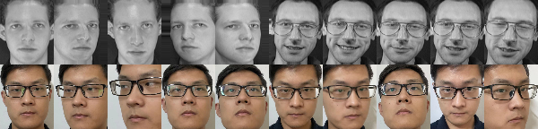
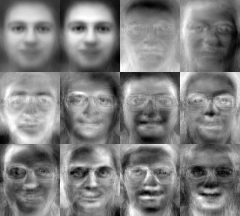
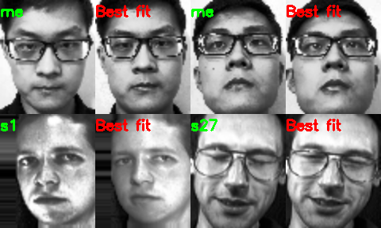
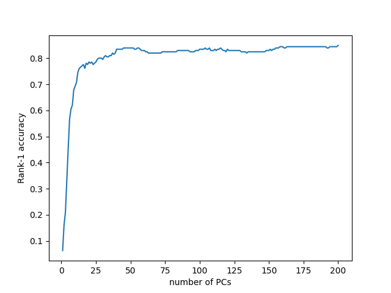
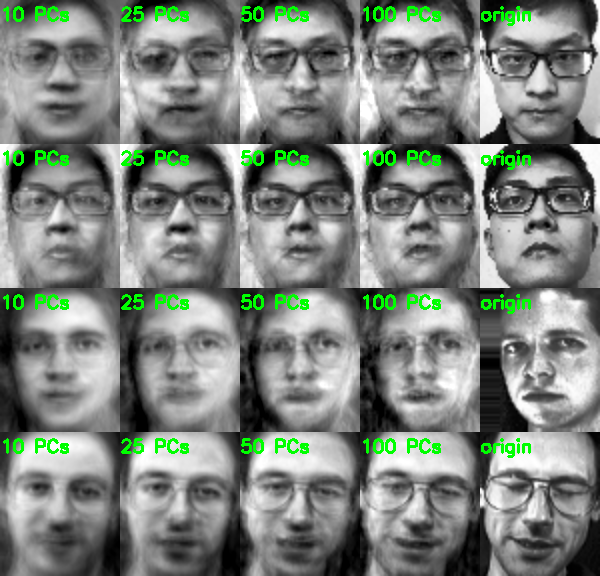

# HW2 Eigenface

### 目录

- [作业内容](#作业内容)
- [方法与结果](#方法与结果)
  - [预处理](#预处理)
  - [训练](#训练)
  - [测试](#测试)
  - [重建](#重建)
  - [其他](#其他)

### 作业内容

不直接使用 `OpenCV` 中 Eigenface 相关函数的条件下，完成 Eigenface 的训练、测试、重建。

### 方法与结果

#### 预处理

首先将图片进行预处理，流程如下：

1. 标注出每张图片眼睛的中心位置；
2. 根据模板对图片进行缩放（`resize`）、平移等操作，截取面部图像，并对齐眼睛位置；
3. 使用 `cvtColor` 函数对图像转为灰度图；
4. 使用 `equalizeHist` 对图像直方图均衡化；
5. 使用 `convertTo` 将图片转化为浮点型以便后续计算。

其中，模板大小设置为 $60\times72$。对于 AT&T 数据集，因其图片已然很小，所以在步骤 2 前使用 `copyMakeBorder` 扩大边界，防止裁剪时出现错误。

图片预处理部分结果如下：

其中，第一行来自于 AT&T 数据集，第二行是我的个人照片。

详细代码见 `FaceLoader.cpp` 中的 `getFace` 和 `preprocess` 函数。

#### 训练

训练过程如下：

1. 计算训练集平均脸；
2. 计算协方差矩阵 $\Sigma = \frac{1}{N}X^TX$，其中 $X$ 是训练集矩阵，每行代表一个样本；
3. 使用 `eigen` 函数求解 $\Sigma$ 的特征值和特征向量；
4. 根据输入的能量百分比选择保留的主成分个数，并使用 `FileStorage` 保存到文件中；
5. 将平均脸和前 11 个特征脸组合成一张图片并显示。

训练结果如下：

详细代码见 `FaceLoader.cpp` 中的 `train` 函数。

#### 测试

测试过程如下：

1. 使用 `FileStorage` 读取模型文件；
2. 分别将测试图片和训练图片变换到特征向量空间；
3. 计算测试图片对应的向量与训练样本对应向量的欧式距离，并获得最小距离对应的样本；
4. 根据最相似的样本确定测试图片的类别；
5. 使用 `putText`、`hconcat` 等函数组成结果图片并显示。

部分测试结果如下：

此外，程序还可批量测试所有测试样本，并计算不同 PC 数量下的准确率，结果以 `PC数量 正确个数 错误个数` 的格式输出到 `txt` 文件，后续通过 `Python`  画出曲线图，结果如下：

详细代码见 `FaceLoader.cpp` 中的 `test` 和 `test_all` 函数。

> **注意：**测试、重建程序使用的人脸照片必需为已经预处理过的图片，`att_faces` 目录中提供了所有预处理过的人脸，它们与原图片名相同，以 `.png` 为结尾。

#### 重建

重建过程如下：

1. 使用 `FileStorage` 读取模型文件；
2. 使用矩阵乘法，将测试图片转换到特征向量空间；
3. 根据预先设置的 PC 数量，再次作矩阵乘法重建图片；
4. 将不同的 PC 数量的重建图片组合成结果，并显示。

重建结果如下：

详细代码见 `FaceLoader.cpp` 中的 `reconstruct` 函数。

#### 其他

以上三个操作分别对应 `train.cpp`、`test.cpp`、`reconstruct.cpp` 三个文件，命令行参数处理使用 [cmdline][cmdline] 开源库。

[cmdline]: https://github.com/tanakh/cmdline