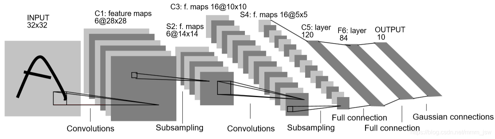
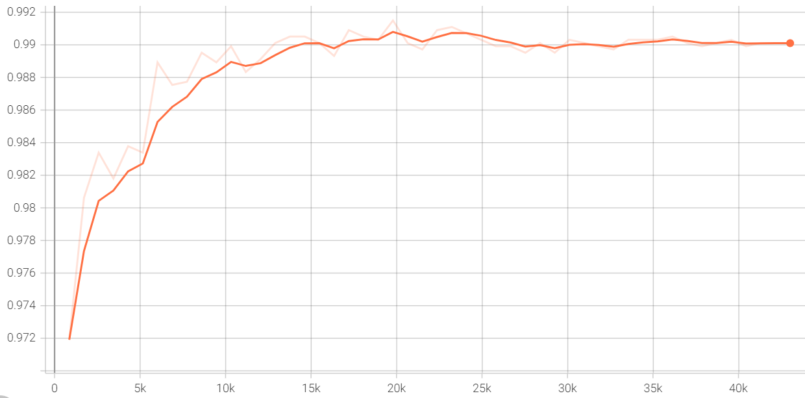
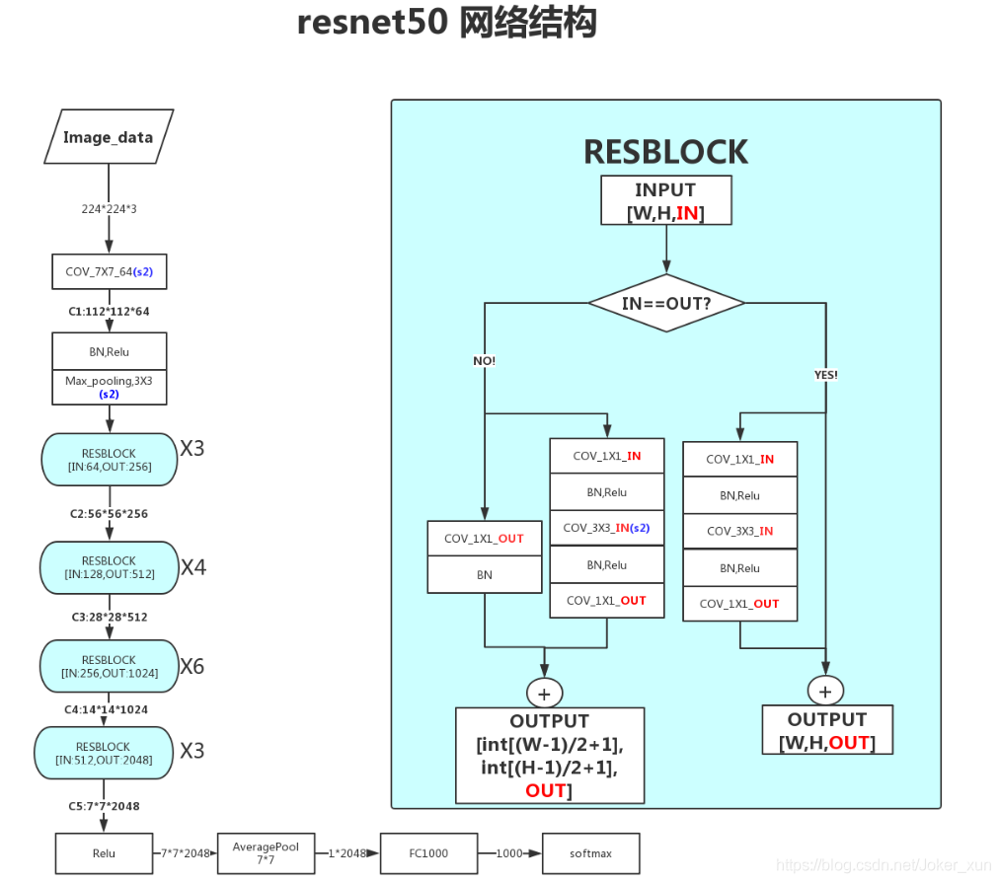
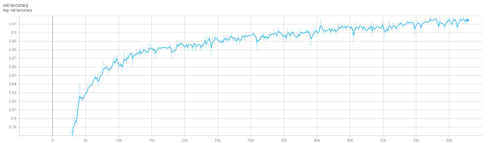

# HW 3 - CNN

### 目录

- [依赖](#依赖)
- [MNIST](#MNIST)
- [CIFAR10](#CIFAR10)

### 依赖

本实验使用 `pytorch` 和 `pytorch-lightning` 完成 CNN 训练任务。

### MNIST

网络结构使用 [LeNet5](https://ieeexplore.ieee.org/document/726791?reload=true&arnumber=726791) 对手写数字数据集进行分类测试。



训练参数如下

|              | 参数                                   |
| ------------ | -------------------------------------- |
| 优化器       | Adam                                   |
| 学习率       | 0.001 with Exponential scheduler       |
| weight decay | 1e-4                                   |
| batch size   | 64                                     |
| early stop   | patience=10 monitering validation loss |
| min epoch    | 50                                     |

训练过程验证集准确率变化如下。



测试集准确率如下

|        | Accuracy |
| ------ | -------- |
| 测试集 | 0.990    |

使用方法

```shell
$ python mnist.py --help
usage: mnist.py [-h] [--dataset PATH] [--log PATH] [--modeldir PATH]
                [--out PATH] [--gpus gpus] [--min_epochs MIN_EPOCHS]
                [--max_epochs MAX_EPOCHS] [--bz batch_size] [--lr lr]
                [--weight_decay weight_decay]
                mode

MNIST

positional arguments:
  mode                  mode, train or test

optional arguments:
  -h, --help            show this help message and exit
  --dataset PATH        dataset path
  --log PATH            log path
  --modeldir PATH       model path
  --out PATH            out path
  --gpus gpus           GPU id
  --min_epochs MIN_EPOCHS
                        min epochs
  --max_epochs MAX_EPOCHS
                        max epochs
  --bz batch_size       batch size
  --lr lr               learning rate
  --weight_decay weight_decay
                        weight decay
```

### CIFAR10

网络结构使用 [ResNet50](https://openaccess.thecvf.com/content_cvpr_2016/html/He_Deep_Residual_Learning_CVPR_2016_paper.html) 对物体识别数据集进行分类测试。



> 注意：pytorch 的 ResNet 以 ImageNet 为训练集，因此在用到 CIFAR10上时需要将第一层卷积核改小（3，3），并去除一个池化层
>
> ```python
> self.net = resnet50()
> self.net.conv1 = nn.Conv2d(3, 64, kernel_size=(3, 3), stride=(1, 1), padding=(1, 1), bias=False)
> self.net.maxpool = nn.Identity()
> ```

训练参数如下

|              | 参数  |
| ------------ | ----- |
| 优化器       | SGD   |
| 学习率       | 0.001 |
| momentum     | 0.9   |
| weight decay | 5e-4  |
| batch size   | 256   |
| epoch        | 400   |

训练过程验证集准确率变化如下。



测试集准确率如下

|        | Accuracy |
| ------ | -------- |
| 测试集 | 0.902    |

使用方式

```shell
$ python cifar10.py --help
usage: cifar10.py [-h] [--dataset PATH] [--log PATH] [--modeldir PATH]
                  [--out PATH] [--gpus gpus] [--min_epochs MIN_EPOCHS]
                  [--max_epochs MAX_EPOCHS] [--bz batch_size] [--lr lr]
                  [--weight_decay weight_decay]
                  mode

CIFAR10

positional arguments:
  mode                  mode, train or test

optional arguments:
  -h, --help            show this help message and exit
  --dataset PATH        dataset path
  --log PATH            log path
  --modeldir PATH       model path
  --out PATH            out path
  --gpus gpus           GPU id
  --min_epochs MIN_EPOCHS
                        min epochs
  --max_epochs MAX_EPOCHS
                        max epochs
  --bz batch_size       batch size
  --lr lr               learning rate
  --weight_decay weight_decay
                        weight decay
```

